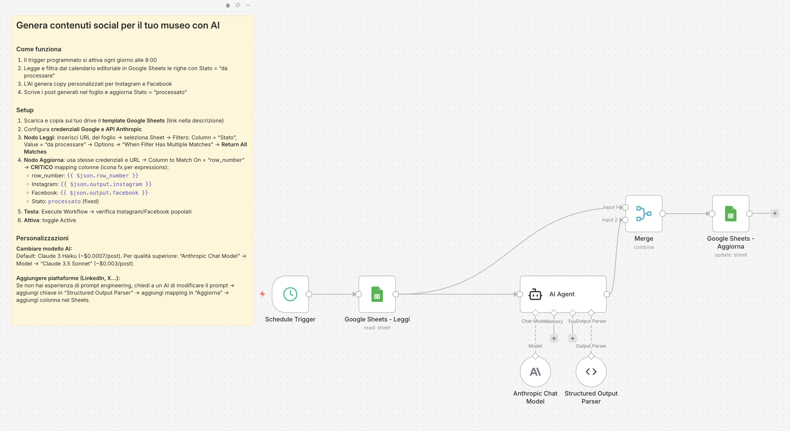
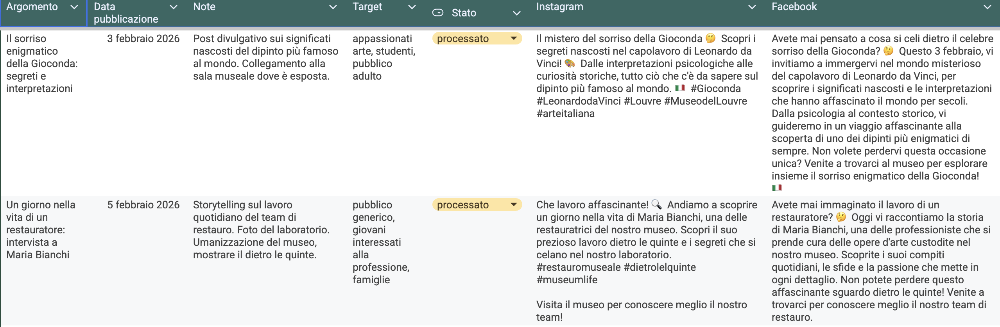

## Workflow n8n per automatizzare la creazione di contenuti social (Instagram e Facebook) per musei italiani usando l'intelligenza artificiale Claude.

> Progetto sviluppato per la tesi di Master "Valutazione e sviluppo di soluzioni automatizzate con strumenti open source per la comunicazione digitale dei musei" - Università Roma Tre, 2026

---

## Cosa fa

Questo workflow automatizza la generazione di post per Instagram e Facebook partendo da un calendario editoriale Google Sheets:

1. Ogni mattina alle 08.00 legge e filtra le righe dal calendario editoriale su Google Sheets con stato = "da processare"
2. L'intelligenza artificiale Claude genera copy ottimizzati per Instagram e Facebook in italiano
3. Scrive i risultati nel foglio e aggiorna lo Stato a "processato"



---

## Template Google Sheets

Il workflow usa un calendario editoriale su Google Sheets con queste colonne:

**Input (da compilare manualmente):**
- Argomento
- Data pubblicazione
- Note (indicazioni specifiche per l'AI)
- Target (pubblico di riferimento)
- Stato (da processare / processato)
- Instagram 
- Facebook 

**[Apri template Google Sheets →](https://docs.google.com/spreadsheets/d/1XRs-JYPtmoKoP4x25H2JolWpkYrZ7-fhm8ra5SmBkN8/edit?gid=0#gid=0)**



---

## Requisiti

**Account e configurazione:**
- Account **n8n** ([cloud gratuito 14 giorni](https://n8n.io/cloud) o [self-hosted](https://docs.n8n.io/hosting/))
- Account **Google Cloud Console** 
- Account **Anthropic** con API key

---

## Installazione

### 1. Importa il workflow in n8n

- Scarica il file `workflow.json` da questo repository
- In n8n: Menu → **Import from File** → seleziona il file
- Il workflow verrà caricato con tutti i nodi già configurati

### 2. Copia il template Google Sheets

- Apri il [template](https://docs.google.com/spreadsheets/d/1XRs-JYPtmoKoP4x25H2JolWpkYrZ7-fhm8ra5SmBkN8/edit?gid=0#gid=0)
- **File → Crea una copia** nel tuo Google Drive

### 3. Configura Google Cloud Console

1. Vai su [Google Cloud Console](https://console.cloud.google.com/)
2. Crea un nuovo progetto
3. Abilita Google Sheets API
4. Configura le credenziali OAuth 2.0
5. Aggiungi metodo di pagamento (carta di credito richiesta anche se non pagherai subito)

Per istruzioni dettagliate: [istruzioni.md](istruzioni.md)

### 4. Configura Anthropic API

1. Crea account su [console.anthropic.com](https://console.anthropic.com/)
2. Aggiungi metodo di pagamento (richiesto, pay-as-you-go)
3. Genera API key
4. In n8n, nodo "Anthropic Chat Model" → inserisci API key

### 5. Collega il tuo foglio

- Nel nodo "Google Sheets - Leggi": incolla l'URL del tuo Google Sheets
- Nel nodo "Google Sheets - Aggiorna": incolla lo stesso URL

### 6. Testa e attiva

- Compila una riga nel foglio con Stato = "da processare"
- Clicca **"Execute Workflow"** in n8n
- Verifica che le colonne Instagram e Facebook si popolino
- Attiva il workflow con il toggle **"Active"**

Per istruzioni passo-passo complete, leggi **[istruzioni.md](istruzioni.md)**.

## Costi

**Claude:**
- Con Haiku 3.0: ~$0.001 per contenuto (2 post)
- Con Sonnet 4.5: ~$0.003 per contenuto (2 post)

**n8n:**
- Cloud: 14 giorni gratis, poi da €20/mese
- Self-hosted: gratuito (serve un server)

**Google Sheets API:**
- Gratuita entro limiti generosi (60 richieste al minuto per utente)

---


## Personalizzazioni

**Cambiare modello AI:**
- Apri il nodo "Anthropic Chat Model"
- In "Model" scegli "Claude Sonnet 4.5" per qualità superiore

**Modificare tone of voice:**
- Apri il nodo "AI Agent"
- Modifica la sezione "General tone" del prompt

**Aggiungere altre piattaforme:**
- Vedi istruzioni dettagliate in [istruzioni.md](istruzioni.md)

---

## Limitazioni

- Genera solo testo (no immagini)
- Richiede supervisione umana per validazione contenuti
- Costi API

---

## 📞 Supporto

- **Issue GitHub**: [Apri una issue](../../issues) per domande o problemi
- **Documentazione n8n**: [docs.n8n.io](https://docs.n8n.io)
- **API Anthropic**: [docs.anthropic.com](https://docs.anthropic.com)

---

## Licenza

MIT License - Libero di usare e modificare per il tuo museo.

---

## Crediti

Progetto di ricerca sviluppato da Maria Linda Pessolano (relatrice Isabella Ducros) nell'ambito della tesi di Master di II livello in "Management, Promozione, Innovazioni Tecnologiche nella Gestione dei Beni Culturali" - Università Roma Tre, 2026. 


**Strumenti utilizzati:**
- [n8n](https://n8n.io) - Workflow automation
- [Claude AI](https://www.anthropic.com) - Anthropic (modelli Sonnet 4.5 / Haiku 3.0)

---

**Se questo progetto ti è utile, lascia una stella su GitHub!**
```
